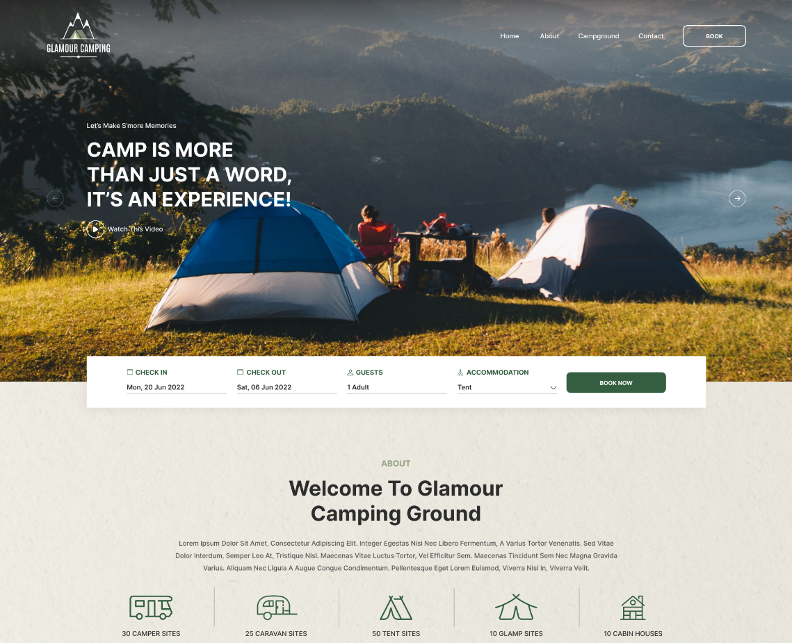
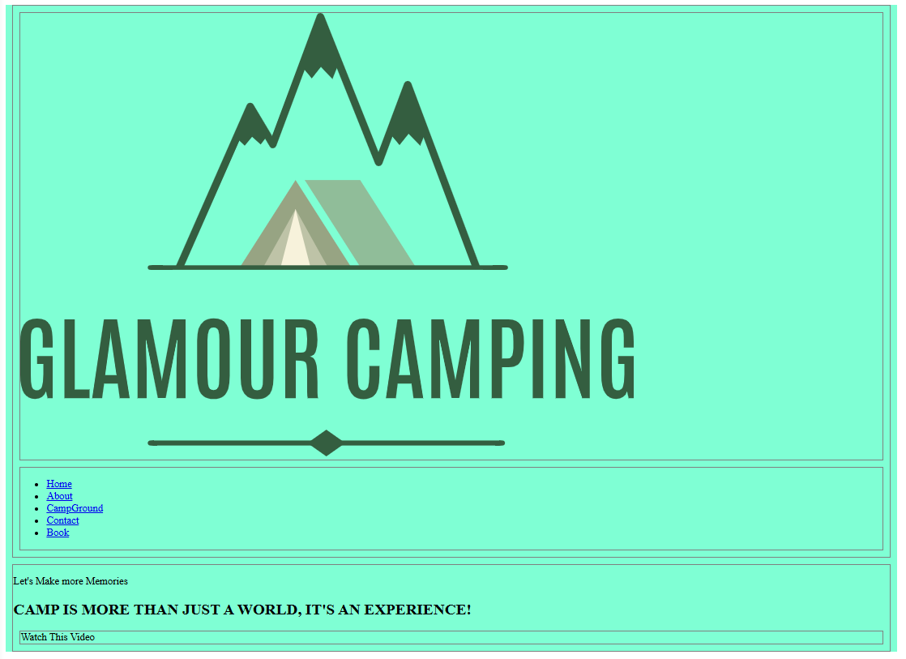
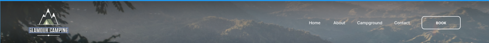
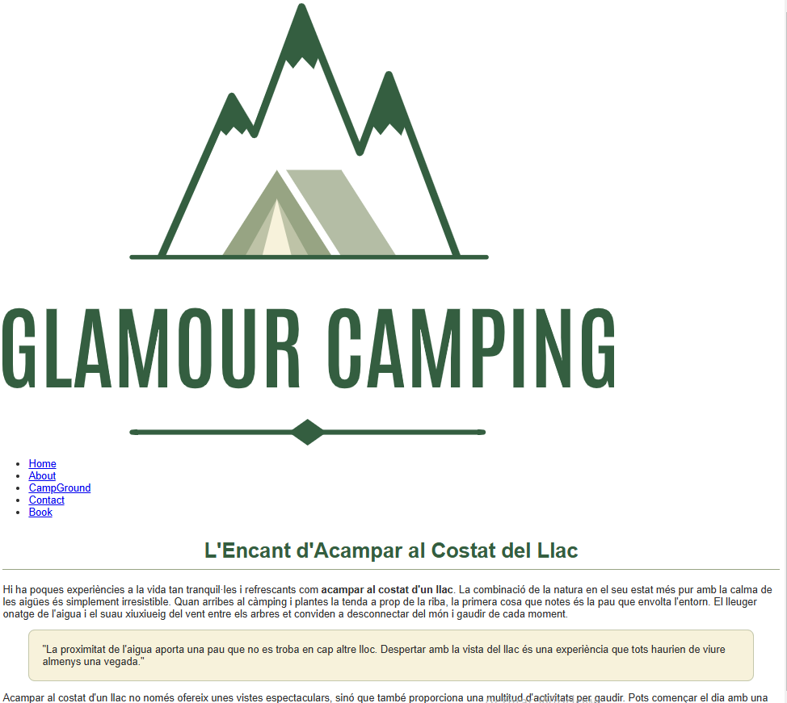
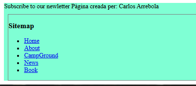
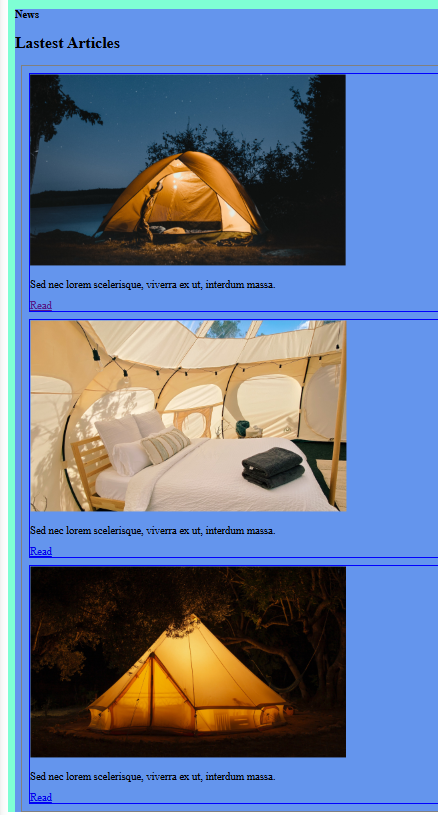

# Història 4 - Menús i links
## Objectiu:

Crea els menús corresponents 
## Tasques
### Tasca 1. Header i Menú superior

- Actualitza el header de home per tal de que es mostri el logo, el menú superior i el titol

 

(Jo he fet servir un paràgraf, h2 i un div pel contingut que hi ha sota el bloc superior corresponen al logo i menu)

*Aquest seria l'aspecte sense estils:*

 
- Afegeix a les pàgines 'articles' un header com el següent:

*De moment aquest seria l'aspecte sense estils:*

### Tasca 2. Sitemap

-  Crea el menú per al sitemap

*Aquest seria l'aspecte sense estils:*

### Tasca 3. Links

-  Actualitza la secció articles de la pàgina 'home' amb la informació dels tres articles que hem creat a la història anterior. 
-  Modifica les imatges i el text 'read' de manera que permetin obrir les pagines dels articles corresponents en la mateixa petanya.

*Aquest seria l'aspecte sense estils:*

### Tasca 4. Comprovació i Confirmació de Canvis:
    
- **Visualitza els canvis:** Utilitza l'entorn de GitHub Codespaces per visualitzar i provar les pàgines web en un navegador integrat.
- **Validació:** Confirma que les pàgines validen correctament.
- **Fes commit i puja els canvis:** Un cop completades les edicions, utilitza Git per fer commit dels canvis al teu repositori i puja els canvis a GitHub.
### Tasca 5. Documentació i Informes:
    
- **Documenta el teu treball:** Documenta el que has fet a l'arxiu ``readme.md`` .

