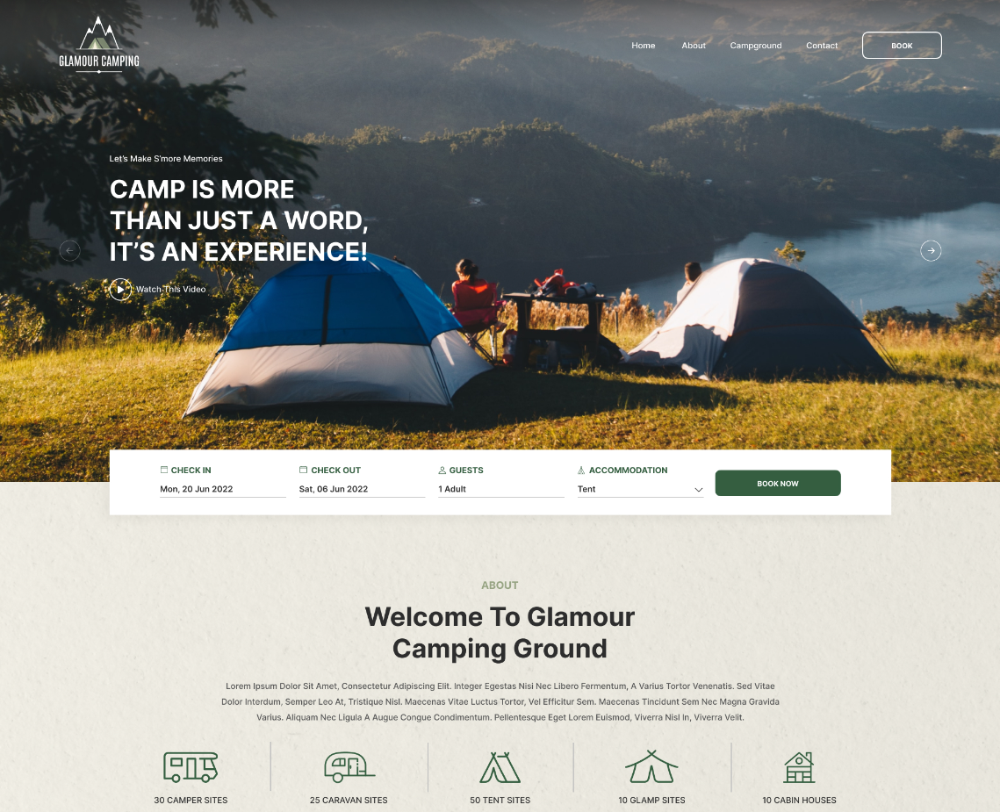

## Objectiu:

Crea els menús corresponents 
## Tasques
### Tasca 1. Header i Menú superior

- Actualitza el header de home per tal de que es mostri el logo, el menú superior i el titol

 
 
- Afegeix a les pàgines 'articles' un header com el següent:

### Tasca 2. Sitemap

-  Crea el menú per al sitemap
### Tasca 3. Links

-  Actualitza la web home per tal que les imatges i els texts 'read' permetin obrir les pagines dels articles corresponents.
### Tasca 4. Comprovació i Confirmació de Canvis:
    
- **Visualitza els canvis:** Utilitza l'entorn de GitHub Codespaces per visualitzar i provar les pàgines web en un navegador integrat.
- **Validació:** Confirma que les pàgines validen correctament.
- **Fes commit i puja els canvis:** Un cop completades les edicions, utilitza Git per fer commit dels canvis al teu repositori i puja els canvis a GitHub.
### Tasca 5. Documentació i Informes:
    
- **Documenta el teu treball:** Documenta el que has fet a l'arxiu ``readme.md`` .

## Recursos

